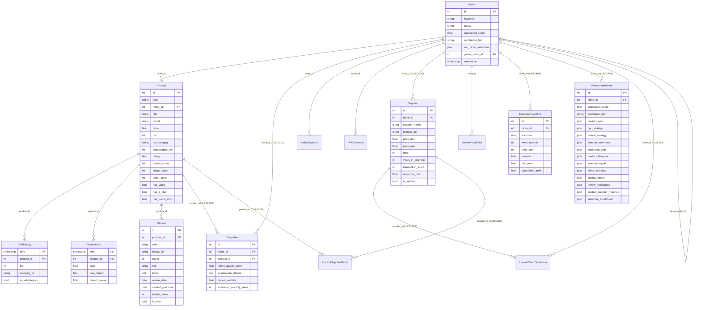
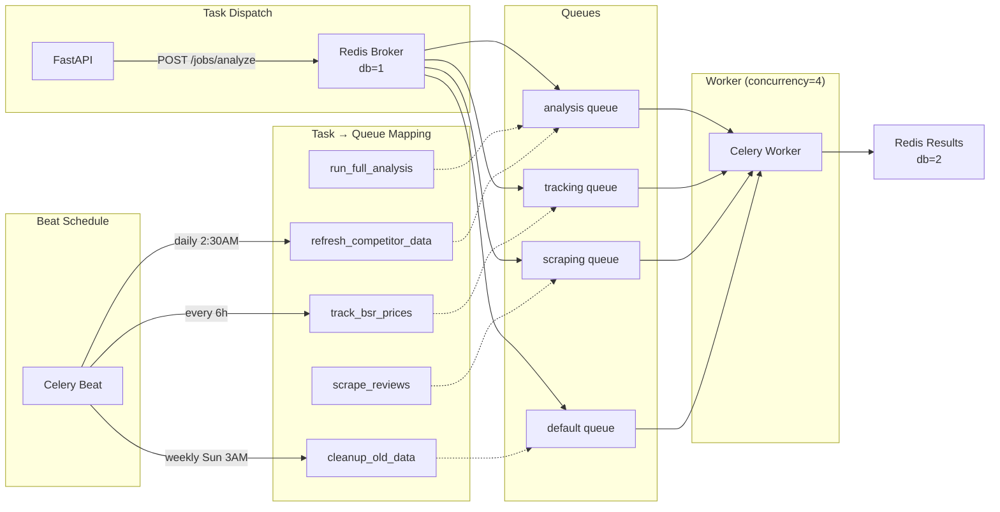
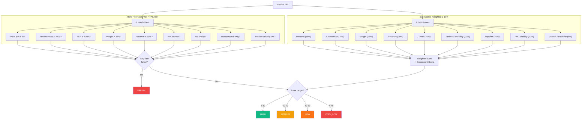
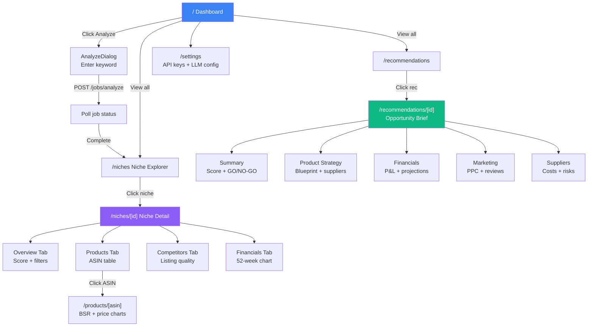

# CLAUDE.md — Project Context for Claude Code

## What is this project?

Omniscient is an Amazon Product Research Engine. It identifies profitable FBA product opportunities by analyzing demand, competition, suppliers, ad costs, review barriers, and sales velocity. It outputs a scored recommendation (0-100 Omniscient Score) with a 52-week financial projection across bull/base/bear scenarios.

## Tech stack

- **Backend:** Python 3.12, FastAPI (async), SQLAlchemy 2.0 (async ORM), Alembic migrations, Celery + Redis for background tasks
- **Frontend:** Next.js 14 (App Router), TypeScript, Tailwind CSS, Recharts for charts
- **Database:** PostgreSQL 16 with TimescaleDB extension (hypertables for BSR and price time-series)
- **LLM:** Configurable provider system — Qwen (default via DashScope), Anthropic Claude, OpenAI GPT. All implement `BaseLLMClient` abstract class.
- **Scraping:** Playwright headless Chromium with rotating proxies (free via proxyscrape.com or paid residential via BrightData/SmartProxy)

## Project layout

```
omniscient/
├── backend/
│   ├── app/
│   │   ├── main.py            # FastAPI app factory, lifespan, middleware
│   │   ├── config.py          # Pydantic Settings from env vars
│   │   ├── dependencies.py    # DI: get_db, get_redis, get_llm_client
│   │   ├── api/               # FastAPI route handlers (28 endpoints)
│   │   ├── models/            # SQLAlchemy 2.0 ORM models (14 tables)
│   │   ├── schemas/           # Pydantic v2 request/response schemas
│   │   ├── services/          # Business logic layer (16 service modules)
│   │   ├── core/              # Utilities (BSR regression, FBA calc, proxy, cache)
│   │   ├── llm/               # LLM provider abstraction + implementations
│   │   └── workers/           # Celery app, tasks, beat schedule
│   ├── migrations/            # Alembic migrations (001-016)
│   ├── tests/                 # pytest suite
│   └── pyproject.toml         # Python deps
├── frontend/
│   └── src/
│       ├── app/               # Next.js App Router pages (incl. /docs)
│       ├── components/        # UI components (sidebar, charts, cards)
│       ├── lib/               # API client (axios), utilities
│       └── types/             # TypeScript type definitions
├── docker-compose.yml
└── .env.example
```

## Service Dependency Graph

```mermaid
graph TD
    subgraph "API Layer"
        NICHES["niches.py"]
        PRODUCTS["products.py"]
        RECS["recommendations.py"]
        JOBS["jobs.py"]
    end

    subgraph "Task Orchestration"
        TASKS["tasks.py<br/>(13-step pipeline)"]
    end

    subgraph "Scraping Services"
        SCRAPER["ScraperService<br/>Amazon pages"]
        SUPP_SCRAPER["SupplierScraper<br/>1688.com"]
        AMZ_LOGIN["AmazonLoginService"]
        ALI_LOGIN["AlibabaLoginService"]
    end

    subgraph "Analysis Services"
        COMP["CompetitorService"]
        REVIEW["ReviewAnalyzer"]
        NICHE_INTEL["NicheIntelligence"]
        BLUEPRINT["ProductBlueprint"]
        SPEC["SpecGenerator"]
        SUPP_MATCH["SupplierMatchService"]
    end

    subgraph "Financial Services"
        SCORING["ScoringService"]
        SUPPLIER["SupplierService"]
        FORECAST["SalesForecast"]
        PPC["PPCService"]
        REV_STRAT["ReviewStrategy"]
        MARKETING["MarketingService"]
        FIN_REPORT["FinancialReport"]
        REC_ENGINE["RecommendationEngine"]
    end

    subgraph "Core Utilities"
        BSR["BSR Regression"]
        FBA["FBA Calculator"]
        PROXY["ProxyManager"]
        COOKIE["CookieManager"]
        LLM["LLM Client"]
    end

    JOBS -->|dispatch| TASKS
    TASKS --> SCRAPER
    TASKS --> SUPP_SCRAPER
    TASKS --> COMP
    TASKS --> REVIEW
    TASKS --> NICHE_INTEL
    TASKS --> BLUEPRINT
    TASKS --> SPEC
    TASKS --> SUPP_MATCH
    TASKS --> SCORING
    TASKS --> SUPPLIER
    TASKS --> FORECAST
    TASKS --> PPC
    TASKS --> REV_STRAT
    TASKS --> MARKETING
    TASKS --> FIN_REPORT
    TASKS --> REC_ENGINE

    SCRAPER --> PROXY
    SUPP_SCRAPER --> PROXY
    SUPP_SCRAPER --> COOKIE
    AMZ_LOGIN --> COOKIE
    ALI_LOGIN --> COOKIE

    REVIEW --> LLM
    NICHE_INTEL --> LLM
    BLUEPRINT --> LLM
    SPEC --> LLM
    SUPP_MATCH --> LLM
    PPC --> LLM
    REV_STRAT --> LLM
    MARKETING --> LLM
    FIN_REPORT --> LLM

    SCORING --> BSR
    SCORING --> FBA
    SUPPLIER --> FBA
    FORECAST --> FBA

    style TASKS fill:#f59e0b,color:#fff
    style LLM fill:#8b5cf6,color:#fff
    style SCRAPER fill:#3b82f6,color:#fff
    style SCORING fill:#10b981,color:#fff
```



## Database Entity Relationship Diagram



## Key architectural decisions

- **Async everywhere:** FastAPI + SQLAlchemy async sessions + asyncpg. Celery workers run in sync context but use `_run_async()` helper to call async service methods.
- **BSR regression:** `app/core/bsr_regression.py` converts BSR to estimated sales using `sales = A * BSR^(-B)` with category-specific coefficients. Handles both main-category and sub-category BSR (10x scaling factor).
- **TimescaleDB hypertables:** `bsr_history` and `price_history` use composite PKs `(time, product_id)` with `implicit_returning=False` for TimescaleDB compatibility.
- **LLM abstraction:** All LLM calls go through `BaseLLMClient.generate_json()` which handles JSON extraction, code fence stripping, and retries.
- **Scoring:** `ScoringService` computes 9 weighted sub-scores (0-100 each) — demand, competition, margin, revenue, trend, review feasibility, supplier, PPC viability, launch feasibility — and applies 9 hard disqualification filters. Any filter failure = FAIL tier. The supplier sub-score returns a neutral `SUPPLIER_UNKNOWN_SCORE = 50.0` when 1688 returned no suppliers at all, instead of scoring fabricated defaults; every assumed input (supplier data, MOQ when suppliers listed none, FOB estimated from price, search volume, revenue per seller, break-even week, review velocity) is recorded in `recommendation.risk_flags["data_gaps"]` (`app/workers/pipeline_steps/assumptions.py`) and shown on the recommendation page's Risk Flags card. Hard filter #9 (review velocity trap) is computed by `apply_review_velocity` in `app/workers/pipeline_steps/review_velocity.py` once it finds at least `MIN_PRODUCTS_FOR_VELOCITY = 3` products in the niche with two review-count snapshots at least `MIN_VELOCITY_WINDOW_DAYS = 14` days apart within the last 90 days; until then `review_velocity_unavailable` shows as a data gap. The observed ratio is always stored as `risk_flags.review_velocity_gap_ratio`, but it disqualifies only when `REVIEW_VELOCITY_FILTER_ENABLED=true` (off by default: the count is Amazon's ratings count, and the trap thresholds are not yet calibrated for it). SP-API-tracked products never get a review count, so the window only accumulates from page scrapes (analysis-time and scrape-based tracking).
- **Free proxy system:** `ProxyManager` supports three modes: `none` (direct), `free` (public proxies from proxyscrape.com with auto-rotation and failure tracking), and paid providers (`brightdata`/`smartproxy` with session-based rotation).
- **Scraping session + SP-API-first:** `BrowserSession` (`app/scraping/session.py`) owns one Chromium browser + context per pipeline run with a single coherent `Persona`, so every page load shares cookies and a consistent fingerprint instead of looking like a new visitor each time. `classify_page()` (`app/scraping/block_detection.py`) verdicts (`ok`/`captcha`/`soft_block`/`server_error`) drive `rotate()`, capped at `MAX_ROTATIONS_PER_SESSION = 3` before the load fails outright. When `SP_API_CLIENT_ID`/`SECRET`/`REFRESH_TOKEN` are all set, `app/workers/pipeline_steps/product_source.py` prefers SP-API Catalog Items and rank snapshots over scraping, enriching from page 1 of the SERP only.
- **Shared pacing:** `SharedPacer` (`app/scraping/pacing.py`) holds a per-domain slot in Redis (`pace:{domain}`, claimed with SET NX and expiring after one random gap) so all Celery worker processes share one gap instead of each process pacing itself; falls back to the per-process `Pacer` when Redis is unreachable (logged once per run, on the `SharedPacer` instance that hit the error).
- **ORM loading:** every `Niche`/`Product`/`Supplier` relationship is `lazy="raise"`; a query that needs a collection asks for it explicitly with `.options(selectinload(Model.relation))`, and deletes rely on the database's `ON DELETE CASCADE` (`passive_deletes=True`) instead of SQLAlchemy nulling out children first.

## How to run

```bash
# Full stack via Docker
docker compose up --build
docker compose exec backend alembic upgrade head

# Or locally
cd backend && pip install -e ".[dev]" && uvicorn app.main:app --reload
cd frontend && npm install && npm run dev
```

## Database

- 17 tables, 3 hypertables (bsr_history, price_history, stock_history)
- 16 migrations in `backend/migrations/versions/`; migration 013 renames the niche score columns to the ScoringService names and adds `avg_rating`, `estimated_monthly_sales`, `last_error`; migration 014 adds the `scrape_events` table (one row per page load attempt, used by `GET /api/v1/niches/scrape-health`); migration 016 adds nullable `bsr_history.review_count`, set on main-rank rows only, so a recent review velocity can be derived from tracker snapshots

## Testing

```bash
cd backend
pytest                    # all tests
pytest -v -k scoring      # just scoring tests
pytest --cov=app          # with coverage
```

Tests under `backend/tests/` cover scoring, forecasting, supplier, recommendation engine, and the extracted pipeline steps / market signals. `pytest -q --co` collects 270 tests. The database- and HTTP-backed tests (`tests/test_db/`, `tests/test_api/`) skip unless `TEST_DATABASE_URL` is set, e.g. `TEST_DATABASE_URL=postgresql+asyncpg://... pytest -q`.

## Common patterns

- **Service constructors** accept `AsyncSession` and optionally `BaseLLMClient`
- **API routes** use `Depends(get_db)` for database sessions
- **Pydantic schemas** use `model_config = ConfigDict(from_attributes=True)` for ORM conversion
- **Frontend pages** are `"use client"` components that fetch from `/api/v1/*` via the axios instance in `src/lib/api.ts`
- **Frontend routing** uses Next.js App Router: `app/niches/[nicheId]/page.tsx`, `app/recommendations/[id]/page.tsx`

## Important files to know

| File | Purpose |
|------|---------|
| `backend/app/services/scoring_service.py` | Omniscient Score calculation (9 sub-scores + 9 filters) |
| `backend/app/services/recommendation_engine.py` | Master orchestrator that coordinates all services |
| `backend/app/services/sales_forecast.py` | 52-week bull/base/bear projections |
| `backend/app/services/competitor_service.py` | Listing quality scoring + vulnerability detection |
| `backend/app/services/supplier_service.py` | Landed cost calculator + margin analysis |
| `backend/app/services/supplier_scraper.py` | 1688.com supplier scraping (factory prices, MOQ, ratings) |
| `backend/app/services/product_blueprint.py` | AI-driven complaint-based product design |
| `backend/app/services/financial_report.py` | Consolidated P&L report with scenario analysis |
| `backend/app/services/market_signals.py` | Pure functions deriving scoring inputs from scraped products/suppliers |
| `backend/app/core/bsr_regression.py` | BSR-to-sales conversion model |
| `backend/app/core/fba_calculator.py` | FBA fee estimation (storage, fulfillment, referral) |
| `backend/app/core/category_mapping.py` | Amazon category name → duty/fee slugs |
| `backend/app/core/proxy_manager.py` | Rotating proxy (free proxyscrape + paid BrightData/SmartProxy) |
| `backend/app/scraping/session.py` | `BrowserSession` — one Chromium browser + context per run, resource blocking, rotation |
| `backend/app/scraping/persona.py` | Builds one coherent UA/platform/locale/viewport `Persona` per session |
| `backend/app/scraping/block_detection.py` | `classify_page()` — ok/captcha/soft_block/server_error verdicts |
| `backend/app/scraping/pacing.py` | Per-domain jittered minimum gap between page loads: in-process `Pacer`, and `SharedPacer` which holds the same gap in Redis so every Celery worker process shares it |
| `backend/app/scraping/page_cache.py` | Redis cache of parsed scrape results (SERP 6h, product 24h TTL) |
| `backend/app/scraping/events.py` | Fire-and-forget `scrape_events` telemetry writes |
| `backend/app/workers/tasks.py` | Celery task definitions (full analysis pipeline) |
| `backend/app/workers/pipeline_steps/` | Extracted pipeline steps: reviews, ppc, product_source (SP-API-first search/BSR), assumptions (data-gap defaults), review_velocity (recent review velocity from BSR snapshots) |
| `backend/app/llm/base_client.py` | LLM provider abstract interface |
| `backend/tests/test_api/` | HTTP-level route tests (httpx `ASGITransport` over the real FastAPI app, real DB rolled back per test); the whole directory skips unless `TEST_DATABASE_URL` is set |
| `frontend/src/components/sidebar.tsx` | Navigation sidebar with active link highlighting |
| `frontend/src/app/page.tsx` | Dashboard |
| `frontend/src/app/docs/page.tsx` | Documentation page |
| `frontend/src/app/recommendations/[id]/page.tsx` | Opportunity brief (5 tabs) |

## Environment variables

All config is in `backend/app/config.py`. Key vars:
- `DATABASE_URL` — Postgres connection string
- `REDIS_URL` — Redis connection string
- `LLM_PROVIDER` — `qwen` | `anthropic` | `openai`
- `DASHSCOPE_API_KEY` / `ANTHROPIC_API_KEY` / `OPENAI_API_KEY` — LLM auth
- `SP_API_*` — Amazon Selling Partner API credentials
- `AMAZON_ADS_*` — Amazon Advertising API credentials
- `PROXY_PROVIDER` — `none` | `free` | `brightdata` | `smartproxy`
- `PROXY_HOST` / `PROXY_PORT` / `PROXY_USERNAME` / `PROXY_PASSWORD` — Paid proxy config (not needed for `free` mode)
- `ALIBABA_APP_KEY` / `ALIBABA_APP_SECRET` — 1688.com supplier API credentials
- `CELERY_BROKER_URL` — Celery Redis broker

## Celery Task Routing



## Scoring Logic Flow



## Frontend Page Flow



## License

Proprietary. All rights reserved. Source is public for reference only.
