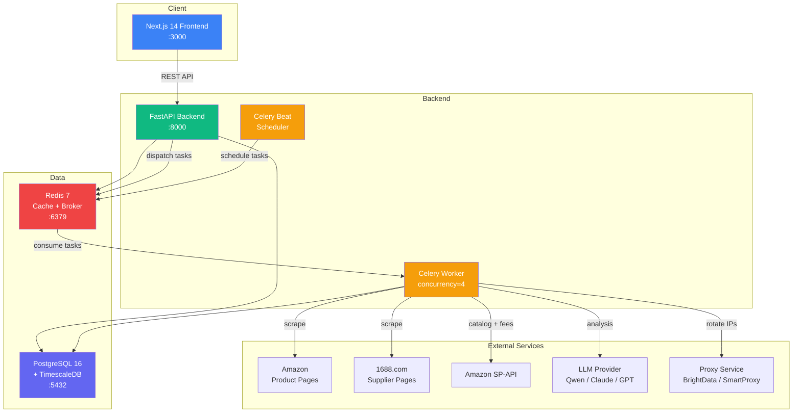
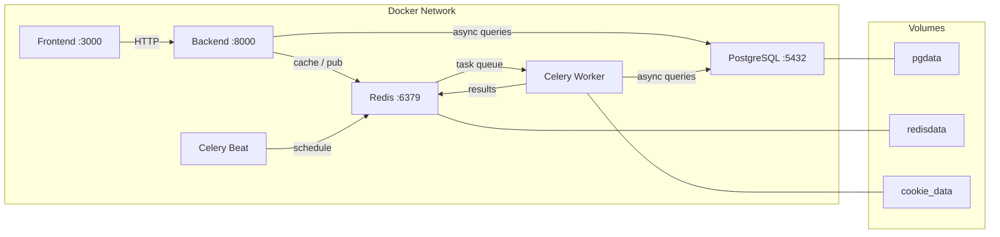
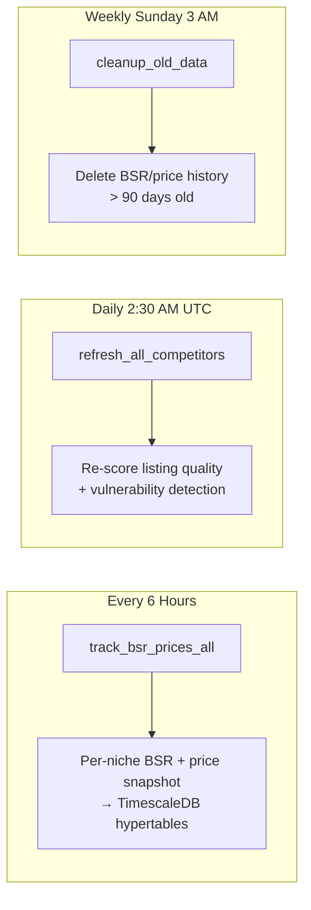
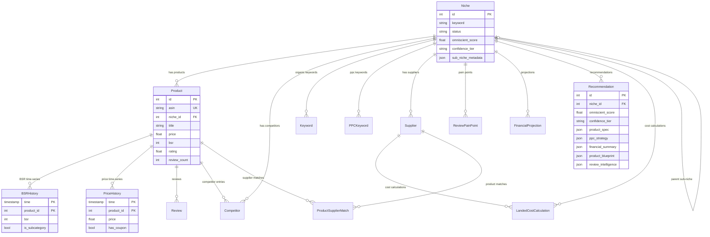
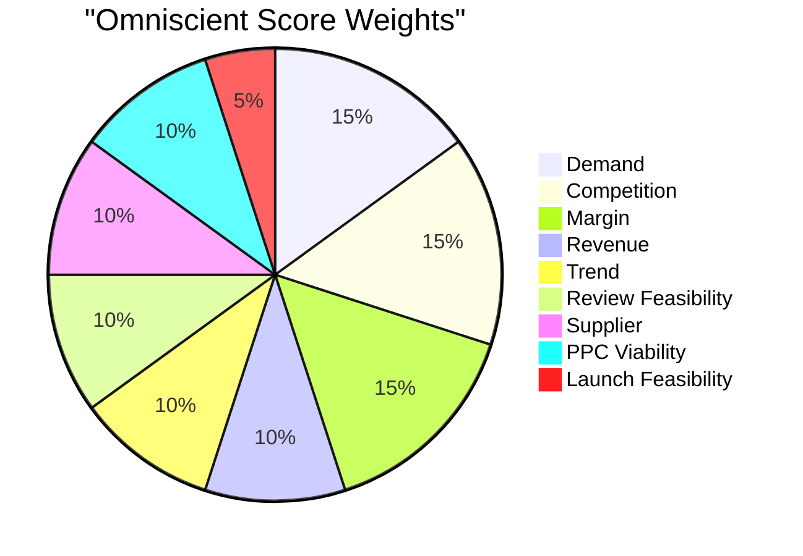

# Omniscient — Amazon Product Research Tool

**Open-source Amazon FBA product research software** — an alternative to Helium 10, Jungle Scout, and AMZScout for finding profitable private label products.

Omniscient is a full-stack Amazon product research engine that automates niche analysis, competitor intelligence, supplier sourcing, profit margin calculation, and sales estimation. It scrapes Amazon product data, tracks BSR (Best Sellers Rank) history, analyzes reviews with AI, calculates landed costs and FBA fees, and generates 52-week financial projections across bull/base/bear scenarios.

Built for Amazon FBA sellers, private label entrepreneurs, and e-commerce businesses who want a self-hosted, data-driven product research tool without recurring SaaS subscription fees.

### Keywords
`amazon product research` `amazon fba tool` `private label product finder` `amazon niche finder` `bsr tracker` `amazon competitor analysis` `fba profit calculator` `amazon keyword research` `product opportunity score` `amazon seller tools` `helium 10 alternative` `jungle scout alternative` `amazon scraper` `fba revenue calculator` `amazon market analysis`

---

## What It Does

1. **Scrapes & collects** Amazon search results, product pages, reviews, and BSR history using headless Playwright browsers with rotating proxies (free via proxyscrape.com or paid residential)
2. **Scrapes 1688.com suppliers** for real factory pricing, MOQs, and supplier ratings to feed into landed cost calculations
3. **Analyzes competition** by scoring listing quality across 7 dimensions and detecting exploitable vulnerabilities
4. **Estimates sales** from BSR using category-specific power-law regression models (handles both main-category and sub-category BSR)
5. **Calculates landed costs** including FOB, shipping, customs duty, Section 301 tariffs, insurance, inspection, FBA prep, and inbound fees
6. **Generates product blueprints** — complaint-driven product design specs built from review pain points, competitor gaps, and differentiation priorities
7. **Runs LLM-powered analysis** for review sentiment, pain point clustering, product spec generation, and competitive insights
8. **Generates 52-week projections** across bull/base/bear scenarios with weekly P&L, cumulative profit, and break-even timelines
9. **Produces consolidated financial reports** with FBA fee breakdowns, unit economics, and scenario-based P&L summaries
10. **Scores opportunities 0-100** (Omniscient Score) using 9 weighted sub-scores and 9 hard disqualification filters
11. **Produces actionable briefs** with product strategy, unit economics, marketing plan, PPC budget, review strategy, and week-by-week launch playbook

---

## Architecture



### Service Communication



## Tech Stack

| Layer | Technology |
|-------|-----------|
| Backend | Python 3.12, FastAPI (async), SQLAlchemy 2.0, Alembic |
| Frontend | Next.js 14 (App Router), TypeScript, Tailwind CSS, Recharts |
| Database | PostgreSQL 16 + TimescaleDB (BSR/price time-series) |
| Queue | Celery with Redis broker |
| LLM | Configurable: Qwen (default), Anthropic Claude, OpenAI GPT |
| Scraping | Playwright (headless Chromium) + rotating proxies (free or paid) |
| Container | Docker + Docker Compose |

---

## Quick Start

### Prerequisites

- Docker & Docker Compose 24+
- Python 3.12+
- Node.js 20+

### 1. Clone and configure

```bash
git clone git@github.com:Umair706/amazon-omniscient.git
cd amazon-omniscient
cp .env.example .env
```

Edit `.env` and add at minimum one LLM API key:

```bash
DASHSCOPE_API_KEY=sk-xxxx     # for Qwen (default)
# or ANTHROPIC_API_KEY=       # for Claude
# or OPENAI_API_KEY=          # for GPT
```

### 2. Start everything

```bash
docker compose up --build
```

### 3. Run database migration

```bash
docker compose exec backend alembic upgrade head
```

### 4. Install Playwright browsers

```bash
docker compose exec backend python -m playwright install chromium --with-deps
```

### 5. Open the app

- **Dashboard:** http://localhost:3000
- **Documentation:** http://localhost:3000/docs (in-app documentation page)
- **API docs:** http://localhost:8000/docs
- **Health check:** http://localhost:8000/health

For detailed setup instructions including local development without Docker, see [SETUP.md](SETUP.md).

---

## Scoring System

### Omniscient Score (0-100)

Weighted composite of 9 sub-scores:

| Sub-Score | Weight | What It Measures |
|-----------|--------|-----------------|
| Demand | 15% | BSR, search volume, monthly sales velocity |
| Competition | 15% | Listing quality, review moat, strong seller count |
| Margin | 15% | Pre-PPC and post-PPC profit margins |
| Revenue | 10% | Price point sweet spot, revenue per seller |
| Trend | 10% | BSR velocity, search volume trend, seasonality |
| Review Feasibility | 10% | Review threshold, weeks to compete |
| Supplier | 10% | Availability, MOQ, supplier quality score |
| PPC Viability | 10% | CPC, break-even ACOS, keyword diversity |
| Launch Feasibility | 5% | Capital required, time to break-even |

### Confidence Tiers

| Tier | Score | Meaning |
|------|-------|---------|
| HIGH | 80+ | Strong buy signal |
| MEDIUM | 60-79 | Viable with caveats |
| LOW | 40-59 | Marginal opportunity |
| VERY_LOW | <40 | Not recommended |
| FAIL | any | Failed hard disqualification filter |

### Hard Disqualification Filters (9)

Any single failure results in automatic FAIL tier regardless of score:

1. Avg price outside $15-$70
2. Median competitor reviews > 2,000
3. Avg BSR > 50,000
4. Pre-PPC margin < 25%
5. Amazon sells > 30% of top listings
6. Restricted/hazmat category
7. IP/patent risk detected
8. Seasonal-only demand (unless explicitly allowed)
9. Review velocity trap (>5 reviews per 100 sales — grey-hat signal)

---

## Project Structure

```
omniscient/
├── docker-compose.yml
├── .env.example
│
├── backend/
│   ├── app/
│   │   ├── main.py               # FastAPI entry point
│   │   ├── config.py             # Environment config
│   │   ├── api/                  # Route handlers
│   │   │   ├── niches.py         # Niche CRUD + sub-resources
│   │   │   ├── products.py       # Product detail + time-series
│   │   │   ├── recommendations.py
│   │   │   ├── settings.py
│   │   │   ├── exports.py        # CSV/PDF export
│   │   │   └── jobs.py           # Background job management
│   │   ├── models/               # SQLAlchemy ORM (14 tables)
│   │   ├── schemas/              # Pydantic request/response
│   │   ├── services/             # Business logic
│   │   │   ├── scoring_service.py        # Omniscient Score
│   │   │   ├── competitor_service.py     # Listing quality + gaps
│   │   │   ├── supplier_service.py       # Landed cost + margins
│   │   │   ├── supplier_scraper.py       # 1688.com supplier scraping
│   │   │   ├── sales_forecast.py         # 52-week projections
│   │   │   ├── recommendation_engine.py  # Master orchestrator
│   │   │   ├── product_blueprint.py      # AI-driven product design
│   │   │   ├── financial_report.py       # Consolidated P&L report
│   │   │   ├── scraper_service.py        # Playwright scraper
│   │   │   ├── spapi_service.py          # Amazon SP-API wrapper
│   │   │   ├── ppc_service.py            # PPC strategy
│   │   │   ├── review_analyzer.py        # LLM sentiment analysis
│   │   │   ├── review_strategy.py        # Vine + organic planning
│   │   │   ├── marketing_service.py      # Launch playbook
│   │   │   └── bsr_tracker.py            # BSR/price tracking
│   │   ├── core/                 # Utilities
│   │   │   ├── bsr_regression.py         # BSR-to-sales model
│   │   │   ├── fba_calculator.py         # FBA fee estimation
│   │   │   ├── proxy_manager.py          # Rotating proxy (free + paid)
│   │   │   ├── middleware.py             # Logging + error handling
│   │   │   └── cache.py                  # Redis cache
│   │   ├── llm/                  # LLM abstraction
│   │   │   ├── base_client.py
│   │   │   ├── qwen_client.py
│   │   │   ├── anthropic_client.py
│   │   │   └── openai_client.py
│   │   └── workers/              # Celery tasks
│   ├── migrations/               # Alembic migrations (4 versions)
│   └── tests/                    # pytest suite
│
├── frontend/
│   └── src/
│       ├── app/                  # Next.js pages
│       │   ├── page.tsx                  # Dashboard
│       │   ├── niches/                   # Explorer + detail
│       │   ├── products/                 # Product detail by ASIN
│       │   ├── recommendations/          # Opportunity briefs
│       │   ├── docs/                     # Documentation page
│       │   └── settings/                 # Credentials config
│       ├── components/
│       │   ├── sidebar.tsx               # Navigation sidebar
│       │   ├── ui/                       # shadcn-style primitives
│       │   └── charts/                   # 9 Recharts components
│       └── lib/                  # API client, utilities
```

---

## API Endpoints (28)

| Method | Path | Description |
|--------|------|-------------|
| `POST` | `/api/v1/niches/` | Create a new niche for analysis |
| `GET` | `/api/v1/niches/` | List niches with pagination |
| `GET` | `/api/v1/niches/{id}` | Full niche detail |
| `DELETE` | `/api/v1/niches/{id}` | Delete a niche |
| `GET` | `/api/v1/niches/{id}/products` | Products in niche |
| `GET` | `/api/v1/niches/{id}/competitors` | Competitor analysis |
| `GET` | `/api/v1/niches/{id}/keywords` | Keyword data |
| `GET` | `/api/v1/niches/{id}/reviews` | Review pain points |
| `GET` | `/api/v1/niches/{id}/financials` | 52-week projections |
| `GET` | `/api/v1/niches/{id}/suppliers` | Supplier data |
| `GET` | `/api/v1/products/{asin}` | Product detail by ASIN |
| `GET` | `/api/v1/products/{asin}/bsr-history` | BSR time-series |
| `GET` | `/api/v1/products/{asin}/price-history` | Price time-series |
| `GET` | `/api/v1/recommendations/` | All recommendations |
| `GET` | `/api/v1/recommendations/{id}` | Full opportunity brief |
| `POST` | `/api/v1/jobs/analyze` | Trigger analysis by keyword |
| `POST` | `/api/v1/jobs/analyze-niche` | Trigger analysis for existing niche |
| `GET` | `/api/v1/jobs/{id}/status` | Poll job progress |
| `GET` | `/api/v1/settings/` | View settings |
| `PUT` | `/api/v1/settings/` | Update credentials |
| `GET` | `/api/v1/exports/niches/{id}/csv` | Export niche data as CSV |
| `GET` | `/api/v1/exports/recommendations/{id}/pdf` | Export recommendation as PDF |
| `GET` | `/health` | Health check |

Full interactive docs at http://localhost:8000/docs after starting the backend.

---

## Screenshots

*Coming soon — run the app locally to explore the dashboard, niche explorer, and opportunity briefs.*

---

## Feature Comparison

How Omniscient compares to popular Amazon seller tools:

| Feature | Omniscient | Helium 10 | Jungle Scout | AMZScout |
|---------|-----------|-----------|-------------|---------|
| Product research / niche finder | Yes | Yes | Yes | Yes |
| BSR tracking & history | Yes | Yes | Yes | Yes |
| BSR-to-sales estimation | Yes (category-specific regression) | Yes | Yes | Yes |
| Sub-category BSR handling | Yes (10x scaling) | Partial | No | No |
| Competitor listing quality scoring | Yes (7 dimensions) | No | No | No |
| Review sentiment analysis (AI) | Yes (LLM-powered) | No | No | No |
| Review velocity gap detection | Yes | No | No | No |
| 1688.com supplier scraping | Yes (factory pricing, MOQ, ratings) | No | No | No |
| Landed cost calculator (China to FBA) | Yes (tariffs, duties, FBA fees) | Basic | Yes | Basic |
| Product blueprint (complaint-driven design) | Yes (AI-generated) | No | No | No |
| Consolidated financial report | Yes (FBA fees, unit economics, P&L) | No | No | No |
| 52-week financial projections | Yes (3 scenarios) | No | No | No |
| Opportunity scoring (0-100) | Yes (9 sub-scores + 9 filters) | Yes (simpler) | Yes (simpler) | Yes (simpler) |
| PPC budget planning | Yes (3-phase) | Yes | No | No |
| Free proxy rotation | Yes (proxyscrape.com) | N/A | N/A | N/A |
| Launch playbook generation | Yes (AI-generated) | No | No | No |
| Supplier comparison (AI) | Yes | No | Yes | No |
| Self-hosted / no subscription | Yes | No ($99/mo) | No ($49/mo) | No ($30/mo) |
| Configurable LLM (Qwen/Claude/GPT) | Yes | N/A | N/A | N/A |
| Open source code | Yes (visible) | No | No | No |

---

## Use Cases

- **Amazon FBA sellers** researching new private label product opportunities
- **E-commerce entrepreneurs** validating product ideas before investing
- **Amazon wholesale sellers** analyzing market demand and competition
- **Product sourcing teams** calculating landed costs and profit margins
- **PPC managers** planning Amazon advertising budgets and keyword strategy
- **Market researchers** tracking BSR trends and category performance

---

## How the Analysis Pipeline Works

```mermaid
flowchart TD
    START(["Keyword Input"]) --> S1

    subgraph Scraping["Phase 1 — Data Collection"]
        S1["1. Scrape Amazon Search Results<br/>3 pages → 60 products"]
        S2["2. Scrape Product Detail Pages<br/>Top 20 ASINs"]
        S2c["2c. Extract Reviews<br/>From product page HTML"]
        S1 --> S2 --> S2c
    end

    subgraph Analysis["Phase 2 — AI Analysis"]
        S3["3. Competitor Analysis<br/>Listing quality + vulnerabilities"]
        S4["4. Review Intelligence<br/>LLM sentiment + pain points"]
        S4b["4b. Niche Intelligence Report<br/>Market trends + opportunities"]
        S4c["4c. Product Blueprint<br/>Complaint-driven design"]
        S5["5. Product Spec + Ideas<br/>LLM-generated specs"]
        S2c --> S3 --> S4 --> S4b --> S4c --> S5
    end

    subgraph Sourcing["Phase 3 — Supplier + Costs"]
        S6a["6a. 1688.com Supplier Scraping<br/>Factory prices, MOQ, ratings"]
        S6aii["6a-ii. Translate Suppliers<br/>Chinese → English via LLM"]
        S6aiii["6a-iii. Supplier Matching<br/>Match suppliers to products"]
        S6b["6b. Landed Cost Calculation<br/>FOB + shipping + tariffs + FBA"]
        S5 --> S6a --> S6aii --> S6aiii --> S6b
    end

    subgraph Strategy["Phase 4 — Strategy + Financials"]
        S7["7. Omniscient Scoring<br/>9 sub-scores + 9 hard filters"]
        S8["8. PPC Strategy<br/>Keywords + bids + budget"]
        S9["9. Review Strategy<br/>Vine + organic roadmap"]
        S10["10. Financial Projections<br/>52-week bull/base/bear"]
        S11["11. Marketing Plan<br/>90-day launch playbook"]
        S12["12. Financial Report<br/>P&L + scenario analysis"]
        S6b --> S7 --> S8 --> S9 --> S10 --> S11 --> S12
    end

    S12 --> S13["13. Save Recommendation<br/>Omniscient Score + full brief"]
    S13 --> DONE(["Analysis Complete"])

    style START fill:#3b82f6,color:#fff
    style DONE fill:#10b981,color:#fff
    style Scraping fill:#fef3c7,stroke:#f59e0b
    style Analysis fill:#dbeafe,stroke:#3b82f6
    style Sourcing fill:#fce7f3,stroke:#ec4899
    style Strategy fill:#d1fae5,stroke:#10b981
```



### Periodic Background Tasks



---

## Data Model



### Scoring Breakdown



---

## License

Copyright (c) 2026 Umair706. All Rights Reserved.

This source code is made publicly visible for reference and transparency purposes only. No permission is granted to use, copy, modify, or distribute this software without prior written authorization. See [LICENSE](LICENSE) for full terms.

For licensing inquiries, contact via GitHub: [@Umair706](https://github.com/Umair706)
