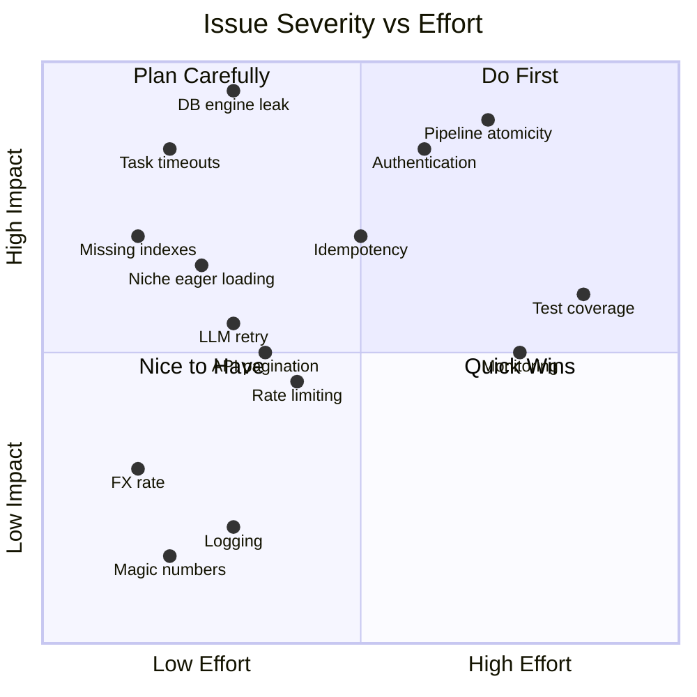

# TODO — Code Review Findings

## Recommended Fix Order

```mermaid
flowchart LR
    subgraph "Phase 1 — Stability"
        A["DB engine leak<br/>+ task timeouts"] --> B["Pipeline atomicity"]
        B --> C["Missing DB indexes"]
    end

    subgraph "Phase 2 — Correctness"
        C --> D["Niche eager loading"]
        D --> E["Idempotency +<br/>duplicate guards"]
        E --> F["LLM retry logic"]
    end

    subgraph "Phase 3 — Security"
        F --> G["Authentication<br/>+ CORS"]
        G --> H["Rate limiting +<br/>prompt sanitization"]
    end

    subgraph "Phase 4 — Quality"
        H --> I["API pagination"]
        I --> J["Alembic migrations"]
        J --> K["Test coverage +<br/>monitoring"]
    end

    style A fill:#ef4444,color:#fff
    style B fill:#ef4444,color:#fff
    style C fill:#f59e0b,color:#fff
    style D fill:#f59e0b,color:#fff
    style E fill:#f59e0b,color:#fff
    style F fill:#f59e0b,color:#fff
    style G fill:#ef4444,color:#fff
    style H fill:#f97316,color:#fff
    style I fill:#f59e0b,color:#fff
    style J fill:#f97316,color:#fff
    style K fill:#6b7280,color:#fff
```

## Impact Map

## CRITICAL

- [ ] **DB session/engine leak** — `tasks.py` creates `create_async_engine()` + `async_sessionmaker()` inside every task invocation; engines accumulate and never close
- [ ] **Pipeline atomicity** — `tasks.py` 13-step pipeline commits after each step; if step 8 fails, steps 1-7 are already committed with partial data
- [ ] **No authentication** — All API endpoints are public; anyone can trigger analyses, delete data, access all results
- [ ] **Permissive CORS** — `main.py` uses `allow_origins=["*"]` in production

## HIGH

- [ ] **No task timeouts** — Celery tasks have no `time_limit` or `soft_time_limit`; a stuck scrape blocks the worker forever
- [ ] **No idempotency** — Re-running an analysis duplicates all data
- [ ] **Review duplicate race** — `SELECT` then `INSERT` without unique constraint allows duplicates under concurrency
- [ ] **Niche eager loading** — `Niche` queries load all related products, reviews, recommendations eagerly
- [ ] **Missing DB indexes** — No indexes on `Product.asin`, `Review.review_id`, `NicheProduct.niche_id`
- [ ] **LLM retry logic** — No retry/backoff on LLM API failures
- [ ] **Unbounded API responses** — List endpoints return all rows with no pagination

## MEDIUM

- [ ] **Hardcoded FX rate** — `supplier_match.py` uses `CNY_TO_USD = 0.14` that never updates
- [ ] **Metrics dict mutation** — `scoring_service.py` mutates input dict in place
- [ ] **BSR sub-category tracking** — All ASINs use same regression regardless of category
- [ ] **Financial hardcoded rates** — `fba_calculator.py` FBA fees and referral rates are static
- [ ] **Scraper output validation** — `scraper_service.py` has no schema validation on scraped data
- [ ] **Proxy rotation gaps** — `proxy_manager.py` proxy errors don't trigger rotation
- [ ] **Frontend error handling** — API errors show raw error text or fail silently
- [ ] **No rate limiting** — No request throttling on API routes
- [ ] **Celery beat schedule drift** — Beat schedule uses file-based store, can drift
- [ ] **Docker health check gaps** — No health check on frontend service
- [ ] **No DB migrations** — No Alembic setup; schema changes require manual intervention
- [ ] **LLM prompt injection** — User-provided keywords injected into prompts without sanitization

## LOW

- [ ] **Magic numbers** — Thresholds like `85`, `0.7`, `10` scattered without named constants
- [ ] **Inconsistent logging** — Mix of `print()` and `logger` calls
- [ ] **No type hints on some returns** — Various service methods missing return types
- [ ] **Dead code** — `supplier_scraper.py` has unused fallback selectors
- [ ] **Test coverage** — No test files found anywhere in the project
- [ ] **`.env` in repo root** — `.env` with credentials should be in `.gitignore`
- [ ] **No graceful shutdown** — Workers have no signal handling for clean shutdown
- [ ] **Frontend bundle size** — No code splitting or lazy loading
- [ ] **No monitoring/alerting** — No health metrics, error rate tracking, or alerts
