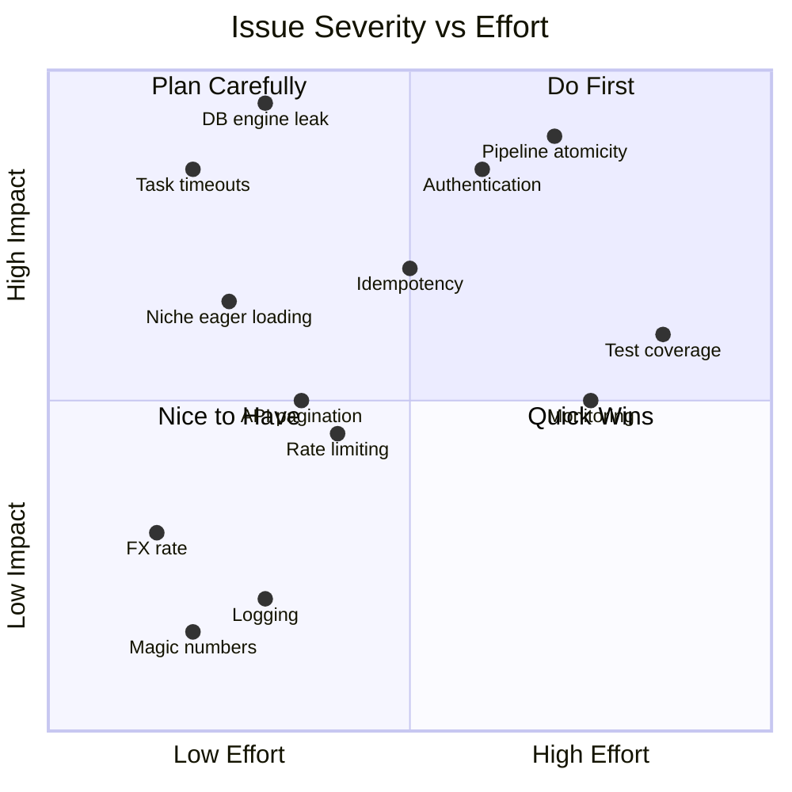

# TODO — Code Review Findings

## Recommended Fix Order

```mermaid
flowchart LR
    subgraph "Phase 1 — Stability"
        A["DB engine leak<br/>+ task timeouts"] --> B["Pipeline atomicity"]
        B --> C["Missing DB indexes"]
    end

    subgraph "Phase 2 — Correctness"
        C --> D["Niche eager loading"]
        D --> E["Idempotency +<br/>duplicate guards"]
        E --> F["LLM retry logic"]
    end

    subgraph "Phase 3 — Security"
        F --> G["Authentication<br/>+ CORS"]
        G --> H["Rate limiting +<br/>prompt sanitization"]
    end

    subgraph "Phase 4 — Quality"
        H --> I["API pagination"]
        I --> J["Alembic migrations"]
        J --> K["Test coverage +<br/>monitoring"]
    end

    style A fill:#ef4444,color:#fff
    style B fill:#ef4444,color:#fff
    style C fill:#f59e0b,color:#fff
    style D fill:#f59e0b,color:#fff
    style E fill:#f59e0b,color:#fff
    style F fill:#f59e0b,color:#fff
    style G fill:#ef4444,color:#fff
    style H fill:#f97316,color:#fff
    style I fill:#f59e0b,color:#fff
    style J fill:#f97316,color:#fff
    style K fill:#6b7280,color:#fff
```

## Impact Map

```mermaid
quadrantChart
    title Issue Severity vs Effort
    x-axis Low Effort --> High Effort
    y-axis Low Impact --> High Impact
    quadrant-1 Do First
    quadrant-2 Plan Carefully
    quadrant-3 Nice to Have
    quadrant-4 Quick Wins
    DB engine leak: [0.3, 0.95]
    Task timeouts: [0.2, 0.85]
    Pipeline atomicity: [0.7, 0.9]
    Authentication: [0.6, 0.85]
    Niche eager loading: [0.25, 0.65]
    Idempotency: [0.5, 0.7]
    API pagination: [0.35, 0.5]
    Rate limiting: [0.4, 0.45]
    Test coverage: [0.85, 0.6]
    Monitoring: [0.75, 0.5]
    FX rate: [0.15, 0.3]
    Magic numbers: [0.2, 0.15]
    Logging: [0.3, 0.2]
```

## CRITICAL

- [x] **DB session/engine leak** — fixed: one engine + event loop per Celery worker process, disposed on shutdown (`tasks.py` runtime helpers)
- [ ] **Pipeline atomicity** — `tasks.py` 13-step pipeline commits after each step; if step 8 fails, steps 1-7 are already committed with partial data
- [ ] **No authentication** — All API endpoints are public; anyone can trigger analyses, delete data, access all results
- [x] **Permissive CORS** — fixed: `ALLOWED_ORIGINS` allow-list (default `http://localhost:3000`)

## HIGH

- [x] **No task timeouts** — fixed: soft/hard time limits on every task, no retry after `SoftTimeLimitExceeded`
- [x] **No idempotency** — fixed: forced re-runs and automatic retries reset derived rows first (`pipeline_steps/reset.py`)
- [ ] **Review duplicate race** — `SELECT` then `INSERT` without unique constraint allows duplicates under concurrency
- [x] **Niche eager loading** — fixed: every `Niche`/`Product`/`Supplier` relationship is `lazy="raise"`; a query that needs a collection asks for it explicitly with `selectinload`, and `GET /niches/{id}` now runs one query instead of ~11
- [ ] **Unbounded API responses** — deferred deliberately: every niche sub-list is bounded by the pipeline itself (≤ ~150 products, ≤ 100 keywords, 156 projections, which the financials chart needs in full), so pagination would add envelopes the UI must page through for lists that never exceed one page. Revisit if a niche can ever hold > 500 products.
- [x] **Review velocity hard filter not armed** — fixed: `market_signals.recent_review_velocity_per_month` / `average_recent_velocity_gap` derive reviews-per-month from first/last snapshot ≥ 14 days apart (≥ 3 products, 90-day lookback) instead of the miscalibrated lifetime average; `app/workers/pipeline_steps/review_velocity.py` computes the ratio once a niche has enough tracking history and stores it as `risk_flags.review_velocity_gap_ratio`; hard filter #9 disqualifies on it only when `REVIEW_VELOCITY_FILTER_ENABLED=true`. SP-API-tracked products never get a review count, so the window only accumulates from page scrapes (analysis-time and scrape-based tracking)
- [ ] **Calibrate review-velocity trap threshold against the ratings count; then enable `REVIEW_VELOCITY_FILTER_ENABLED`**
- [ ] **Calibrate the sales model per marketplace.** Only US coefficients are fitted from data; other marketplaces reuse the US curve scaled by a market-size ratio (AU = 8%). This is now *disclosed* — `is_calibrated_marketplace` drives the `sales_estimate_uncalibrated` data gap so non-US briefs say the unit/revenue numbers are US-derived, not measured — but the coefficients still need fitting against a reference set of known ASINs before non-US sales estimates should be trusted for a purchase decision.

## MEDIUM

- [ ] **Hardcoded FX rate** — `supplier_match.py` uses `CNY_TO_USD = 0.14` that never updates
- [ ] **Metrics dict mutation** — `scoring_service.py` mutates input dict in place
- [ ] **BSR sub-category tracking** — All ASINs use same regression regardless of category
- [ ] **Financial hardcoded rates** — `fba_calculator.py` FBA fees and referral rates are static
- [ ] **Scraper output validation** — `scraper_service.py` has no schema validation on scraped data
- [ ] **Frontend error handling** — API errors show raw error text or fail silently
- [ ] **No rate limiting** — No request throttling on API routes
- [ ] **Celery beat schedule drift** — Beat schedule uses file-based store, can drift
- [ ] **Docker health check gaps** — No health check on frontend service
- [ ] **LLM prompt injection** — User-provided keywords injected into prompts without sanitization
- [ ] **`/product-reviews/` requires sign-in on AU** — reviews are product-page-only (≤10/ASIN); the standalone `scrape_reviews` task saves nothing there
- [ ] **1688 login browser is not on the shared pacer** — `AlibabaLoginService` paces itself per process; only used when stored cookies are invalid, so the exposure is small, but it should take a `SharedPacer` like `SupplierScraper` does
- [ ] **Keyword-research scraper session is not on the shared pacer** — the `BrowserSession` behind `POST /niches/{id}/keywords/research` paces per process only
- [x] **Pacer/rotation state is per worker process** — fixed: `SharedPacer` (`app/scraping/pacing.py`) holds a per-domain slot in Redis (`pace:{domain}`, claimed with SET NX and expiring after one random gap) so all worker processes share one gap; every pipeline/worker `BrowserSession` and the 1688 `SupplierScraper` pace through it, falling back to the old per-process `Pacer` if Redis is unreachable
- [x] **Supplier sub-score uses assumed defaults** (count 5 / score 70 / MOQ 500) when 1688 scraping returns nothing — fixed: `_score_supplier` returns a neutral `SUPPLIER_UNKNOWN_SCORE = 50.0` instead, and `apply_assumed_defaults()` records every assumed input (including this one) in `recommendation.risk_flags["data_gaps"]`

## LOW

- [ ] **Amazon login browser is not on the shared pacer** — `AmazonLoginService` paces per process, but it currently has no callers, so this is low priority
- [ ] **`BSRTracker.record_product_snapshot` has 12 keyword parameters** — a snapshot dataclass would read better than a growing keyword-argument list
- [ ] **Magic numbers** — Thresholds like `85`, `0.7`, `10` scattered without named constants
- [ ] **Inconsistent logging** — Mix of `print()` and `logger` calls
- [ ] **No type hints on some returns** — Various service methods missing return types
- [ ] **Dead code** — `supplier_scraper.py` has unused fallback selectors
- [ ] **No graceful shutdown** — Workers have no signal handling for clean shutdown
- [ ] **Frontend bundle size** — No code splitting or lazy loading
- [ ] **No monitoring/alerting** — No health metrics, error rate tracking, or alerts
